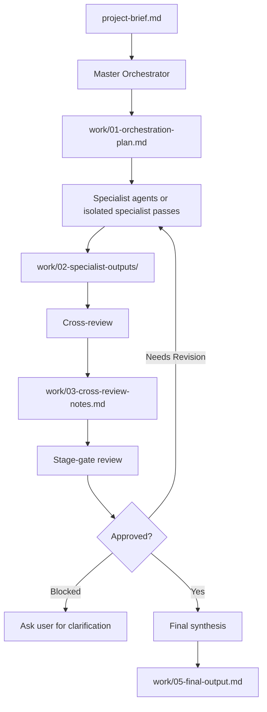

# Universal Agentic R&D Workflow

This file is the complete operating instruction for running a file-driven, multi-agent research and development workflow inside any AI coding-agent environment.

Use this file as the source of truth. Do not require the user to clone or read the rest of this repository. Once the user asks you to start, run the workflow automatically unless a stop condition requires clarification.

## Activation

Start this workflow when the user asks you to run, start, execute, or use the agentic R&D workflow, or when the user asks you to produce a structured research, product, business, technical, strategy, feasibility, or planning deliverable.

The user may provide either:

- An existing `project-brief.md` file.
- A natural-language project idea in the chat.
- A partially complete brief.

## First Action

1. Look for `project-brief.md` in the current workspace.
2. If `project-brief.md` exists, read it completely before doing anything else.
3. If it does not exist and the user's message contains enough context, create `project-brief.md` from the user's message.
4. If essential context is missing, ask only the minimum questions needed to create a usable brief.
5. After the brief exists, continue without asking for permission between workflow phases.

## Project Brief Minimum

The brief must identify:

- Subject: what is being researched, planned, designed, or analyzed.
- Goal: what the workflow should accomplish.
- Desired output: the final deliverable format.
- Audience: who will use the output.
- Constraints: scope, timeline, geography, technical limits, budget, or domain boundaries.
- Success criteria: what makes the final output useful.
- Human review requirements: legal, medical, financial, compliance, security, or safety-critical review boundaries.

If some non-essential fields are unknown, continue and mark them as assumptions. Do not block the workflow for minor missing details.

## Required Output Structure

Use this output structure in the current workspace:

```text
work/
├── 01-orchestration-plan.md
├── 02-specialist-outputs/
├── 03-cross-review-notes.md
├── 04-stage-gate-review.md
└── 05-final-output.md
```

Create the `work/` directory and the first four outputs during the workflow. Do not create or write `work/05-final-output.md` until the stage gate decision is `Approved`.

## Agent Execution Policy

Use real subagents when the environment supports them.

If real subagents are available, delegate each specialist role as a separate subagent with a narrow scope and a required output file.

If real subagents are not available, simulate subagents by running each specialist role as a separate isolated pass. Each simulated specialist must write a separate output file and must not see or merge conclusions from other specialists before cross-review.

Never collapse specialist analysis, cross-review, stage-gate review, and final synthesis into one response.

## Workflow Overview



## Phase 1: Orchestration

Act as the Master Orchestrator.

Read `project-brief.md`, classify the project, select the fewest specialist agents that cover the problem well, and write `work/01-orchestration-plan.md`.

Always include these roles:

- Research Context Agent
- Risk and Assumptions Agent
- Cross-Review Agent
- Stage Gate Reviewer
- Final Synthesizer

Select additional specialists only when relevant:

- Market Research Agent
- Competitor Analysis Agent
- Product Strategy Agent
- Technical Feasibility Agent
- Business Model Agent
- Go-To-Market Agent
- Legal and Compliance Analysis Agent
- Scientific Literature Agent
- Data and Experiment Design Agent
- UX and User Research Agent
- Security and Privacy Agent
- Operations and Implementation Agent

Use this format for `work/01-orchestration-plan.md`:

```markdown
# Orchestration Plan

## Project Classification

- Primary type:
- Secondary types:
- Regulated or sensitive domains:

## Selected Specialist Agents

| Agent | Scope | Output File | Why Needed |
| --- | --- | --- | --- |

## Execution Mode

- Real subagents available: yes or no
- If no, simulated specialist passes will be used

## Workflow Steps

1. Specialist analysis
2. Cross-review
3. Specialist revision if required
4. Stage-gate review
5. Final synthesis after approval

## Success Criteria

- List the criteria the final output must satisfy.

## Stop Conditions

- List the conditions that require user clarification before continuing.
```

## Phase 2: Specialist Analysis

Run each selected specialist independently.

Each specialist must:

- Read `project-brief.md`.
- Read `work/01-orchestration-plan.md`.
- Stay inside its assigned scope.
- Separate facts, assumptions, inferences, risks, and recommendations.
- Cite sources when available.
- State uncertainty clearly.
- Write one file under `work/02-specialist-outputs/`.

Use this file naming pattern:

```text
work/02-specialist-outputs/<number>-<agent-name>.md
```

Use this format for each specialist output:

```markdown
# Specialist Output: <Agent Name>

## Assigned Scope

State the exact scope from the orchestration plan.

## Key Findings

- Finding 1
- Finding 2

## Evidence And Sources

- Source or evidence item, or state when evidence is unavailable.

## Assumptions

- Assumption 1

## Risks And Uncertainties

- Risk or uncertainty 1

## Recommendations

- Recommendation 1

## Questions For Other Agents

- Question 1

## Inputs Needed For Final Synthesis

- Input 1
```

## Phase 3: Cross-Review

After all specialist outputs exist, run cross-review.

The Cross-Review Agent must read all specialist outputs and write `work/03-cross-review-notes.md`.

Use this format:

```markdown
# Cross-Review Notes

## Reviewed Specialist Outputs

- File 1
- File 2

## Agreements

- Agreement 1

## Conflicts

- Conflict 1

## Missing Evidence Or Weak Reasoning

- Issue 1

## Duplicated Or Overlapping Claims

- Claim 1

## Required Specialist Revisions

| Specialist | Required Revision | Reason |
| --- | --- | --- |

## Synthesis Guidance

- Guidance item 1
```

If cross-review finds required revisions, update the relevant specialist files with a `Revisions After Cross-Review` section before proceeding to stage-gate review.

## Phase 4: Stage-Gate Review

Run the Stage Gate Reviewer after cross-review and required revisions.

The Stage Gate Reviewer must decide whether the workflow can proceed.

Decision options:

- `Approved`: final synthesis may begin.
- `Needs Revision`: return to one or more specialists for targeted fixes.
- `Blocked`: stop and ask the user for clarification or missing external input.

Score the package from 0 to 10:

- 0-3: not usable
- 4-5: major revisions required
- 6-7: usable but needs targeted revision
- 8-9: strong enough to proceed
- 10: excellent and ready for synthesis

Only approve if the score is 8 or higher and there are no blocking issues.

Use this format for `work/04-stage-gate-review.md`:

```markdown
# Stage-Gate Review

## Decision

Approved, Needs Revision, or Blocked.

## Quality Score

Score: 0-10

## Review Findings

- Finding 1

## Blocking Issues

- Blocking issue, or state none.

## Required Fixes

| Owner | Required Fix | Required Before Final Synthesis |
| --- | --- | --- |

## Approval Conditions

- Condition 1
```

Allow a maximum of two revision rounds unless the user explicitly authorizes more. If the same issue remains after two rounds, mark the phase as `Blocked` and ask for direction.

## Phase 5: Final Synthesis

Only begin final synthesis after `work/04-stage-gate-review.md` says `Approved`.

The Final Synthesizer must:

- Use only approved specialist outputs, cross-review notes, and the stage-gate review.
- Resolve conflicts explicitly.
- Preserve important uncertainty.
- Distinguish evidence from assumptions.
- Convert analysis into practical recommendations.
- Keep the output aligned with `project-brief.md`.
- Include human-review requirements for regulated or sensitive domains.
- Write `work/05-final-output.md`.

Use this format unless the project brief requests a different structure:

```markdown
# Final Output

## Executive Summary

Summarize the conclusion and most important recommendations.

## Project Context

Explain the brief and constraints.

## Key Findings

- Finding 1

## Evidence Base

- Evidence item 1

## Analysis

Present the integrated analysis.

## Recommendations

- Recommendation 1

## Risks And Limitations

- Risk or limitation 1

## Next Steps

- Step 1

## Open Questions

- Question 1

## Human Review Requirements

- Review requirement 1

```

## Stop Conditions

Stop and ask the user for clarification only when:

- The subject or goal is not identifiable.
- The desired output cannot be inferred.
- Key constraints conflict with each other.
- The workflow requires external data, credentials, private systems, or paid tools that are unavailable.
- The project involves legal, medical, financial, compliance, security, or safety-critical advice and no safe informational boundary can be established.

When a stop condition is not present, continue automatically.

## Quality Rules

- Do not write the final output first.
- Do not skip specialist outputs.
- Do not skip cross-review.
- Do not approve the stage gate if specialist work is missing or weak.
- Do not invent evidence or sources.
- Do not hide uncertainty.
- Do not present regulated professional advice as definitive.
- Do not ask the user for permission between normal workflow phases.
- Do not load unrelated repository documentation unless it is necessary for the user's project.

## Completion Message

When the workflow is complete, tell the user which files were created and whether the stage gate approved final synthesis. Keep the message concise.
