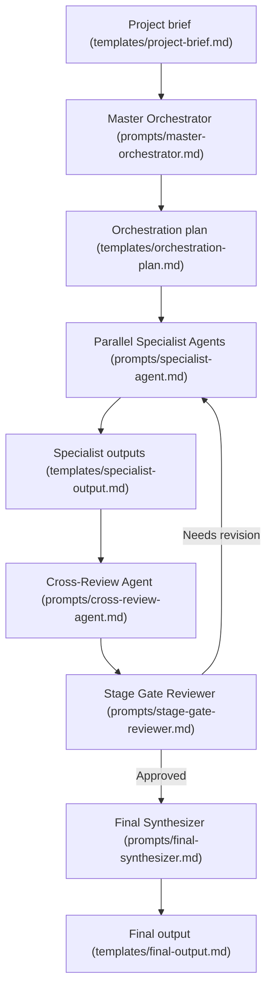

# Agentic R&D Prompt Library

A curated prompt library for file-driven, multi-agent research and development workflows.

This repository provides structured prompts, Markdown guides, and reusable templates that help AI agents transform a project brief into research reports, product strategy documents, technical feasibility analyses, business plans, and final synthesized outputs.

The workflow is inspired by autonomous research systems such as Agent Laboratory, but generalized beyond academic research. It uses specialist agents, parallel analysis, cross-review, blocking stage-gate reviews, and a final synthesis phase to improve output quality and reduce unsupported conclusions.

For day-to-day use, copy only `AGENTS.md` into the project where you want the workflow to run. The rest of this repository exists for documentation, examples, templates, and maintenance.

## What This Is

Agentic R&D Prompt Library is not an application or automation framework. It is a professional prompt library for orchestrating AI agents through a disciplined Markdown-based workflow.

The operational entrypoint is `AGENTS.md`. It is self-contained and tells a coding agent how to create or read `project-brief.md`, generate the `work/` files, use real subagents when available, simulate separate specialist passes when subagents are unavailable, and avoid writing the final output before stage-gate approval.

The core pattern is simple:



## Use Cases

- Market and competitor research
- SaaS and startup opportunity analysis
- Product strategy and MVP scoping
- Technical feasibility studies
- Scientific or technical research planning
- Structured problem solving
- Business model and go-to-market analysis
- Cross-functional decision support

## Repository Structure

```text
/
├── AGENTS.md      # Self-contained operating instruction to copy into a project
├── prompts/       # Reusable agent prompts
├── guides/        # Operating instructions for the workflow
├── templates/     # Input and output Markdown templates
├── examples/      # Example briefs and expected output structures
└── docs/          # Project documentation, limitations, and rationale
```

## Quick Start

1. Copy `AGENTS.md` into the project where you want the workflow to run.
2. Add a `project-brief.md` file, or describe the project idea in your first message.
3. Tell your coding agent: `Read AGENTS.md and run the workflow.`
4. Let the agent continue automatically until it writes the approved final output.

For a step-by-step workflow, see `docs/how-to-use-with-a-coding-agent.md`.

Example instruction:

```text
Read AGENTS.md and run the workflow for this project. If project-brief.md is missing, create it from my request and continue automatically unless essential context is missing.
```

## Core Agents

- `Master Orchestrator`: Reads the project brief, classifies the project, selects specialist agents, and defines the workflow.
- `Specialist Agents`: Produce independent research or analysis from domain-specific perspectives.
- `Cross-Review Agent`: Forces specialists to inspect each other's work, identify conflicts, and revise conclusions.
- `Stage Gate Reviewer`: Blocks progression until the current phase meets quality standards.
- `Final Synthesizer`: Integrates all reviewed outputs into the final deliverable.

## Recommended Output Folder

When using this prompt library in a live project, the workflow produces:

```text
work/
├── 01-orchestration-plan.md
├── 02-specialist-outputs/
├── 03-cross-review-notes.md
├── 04-stage-gate-review.md
└── 05-final-output.md
```

The agent should create `work/05-final-output.md` only after the stage gate is `Approved`. The `work/` folder is ignored by default because it contains project-specific generated outputs.

## Design Principles

- File-driven workflows over vague chat instructions
- Modular prompts instead of one oversized system prompt
- Specialist reasoning before synthesis
- Review gates before progression
- Explicit assumptions and uncertainty
- Human review for legal, medical, financial, security, and compliance-sensitive topics
- Professional outputs with clear structure, evidence, risks, and recommendations

## Safety Notice

This library helps structure AI-assisted research and planning. It does not replace qualified professionals. Outputs involving legal, medical, financial, security, compliance, or safety-critical topics should be reviewed by appropriate human experts before use.

See `docs/safety-and-limitations.md` for details.

## Validation

Run the repository validation suite with:

```bash
npm test
```

The validation checks repository structure, Markdown headings, relative links, critical prompt references, metadata consistency, placeholder hygiene, and GitHub Actions configuration.

See `docs/validation.md` for details.

## Author

Created and maintained by Michael Gasperini.

Website: [mikesoft.it](https://mikesoft.it)

## Inspiration

This project is conceptually inspired by Agent Laboratory by Samuel Schmidgall and collaborators, especially its phased autonomous research workflow, specialized agents, iterative refinement, and reviewer-based quality checks. This repository does not copy its implementation; it adapts the general workflow idea into a Markdown-first prompt library for broader research and development use cases.

See `docs/inspiration.md`.

## License

MIT License. See `LICENSE`.
