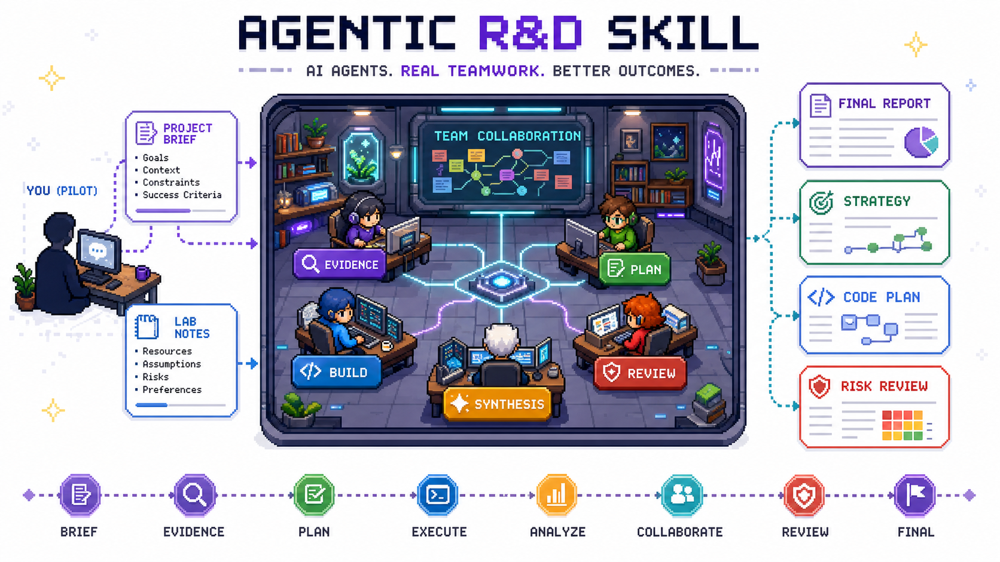

# Agentic R&D Skill — Multi-Agent Research Workflow for AI Coding Agents

[](https://github.com/TheStreamCode/agentic-rd-skill/actions/workflows/ci.yml)
[](https://agentskills.io/specification)
[](CHANGELOG.md)
[](LICENSE)

Agentic R&D Skill is an open-source, portable multi-agent research and development workflow for Codex, Claude Code, GitHub Copilot, Gemini CLI, and OpenCode. It turns complex technical, product, business, feasibility, strategy, and investigation briefs into traceable evidence, executable plans, reviewed results, and gated final reports—without requiring a provider-specific LLM SDK.

<p align="center">
  
</p>

## What Is Agentic R&D Skill?

Agentic R&D is an [Agent Skills](https://agentskills.io/specification) package that gives AI coding agents a repeatable workflow for substantial research and decision-making tasks. It keeps evidence, planning, execution, interpretation, review, and final synthesis separate so users can inspect how a recommendation was produced instead of receiving one opaque answer.

- Uses native subagents when available and a single-agent fallback when they are not.
- Keeps evidence, plan, execution, results, review, and synthesis in separate artifacts with explicit read dependencies.
- Adds a dependency-free Node.js CLI for initialization, state, safe artifact scaffolding, pre-mutation checks, revision proof, stage-gate enforcement, and explicit completion validation.
- Scales from one orchestrator to bounded specialist waves without treating every request as a full laboratory.
- Requires authorization boundaries, source traceability, prompt-injection resistance, and qualified review for sensitive domains.

This is an independent adaptation, not a fork of the Agent Laboratory Python implementation. See [Agent Laboratory](https://github.com/SamuelSchmidgall/AgentLaboratory) and its [paper](https://arxiv.org/abs/2501.04227).

## Best Use Cases

| Task                                          | Why the workflow helps                                                  | Suggested profile                      |
| --------------------------------------------- | ----------------------------------------------------------------------- | -------------------------------------- |
| Technical feasibility study                   | Separates observed constraints from inferred effort and recommendations | `compact` or `standard`                |
| Software architecture or modernization review | Coordinates code, architecture, security, operations, and UX evidence   | `standard`                             |
| Product strategy or competitor research       | Preserves sources, assumptions, minority views, and decision criteria   | `standard`                             |
| Complex incident investigation                | Records failed attempts, evidence, uncertainty, and safe next actions   | `compact` when urgent                  |
| Business, market, or implementation planning  | Produces an auditable plan with acceptance criteria and risks           | `standard`                             |
| Regulated or safety-sensitive assessment      | Adds explicit review gates and authorization boundaries                 | `extended` with qualified human review |

Do not activate the skill for simple questions, routine bug fixes, or small refactors. The process is useful when at least two of these apply: multiple evidence sources, multiple specialties, a durable audit trail, meaningful decision risk or uncertainty, or valuable independent cross-review.

## Agentic R&D vs. Agent Laboratory

Agentic R&D is a modern, portable adaptation of the workflow ideas behind Agent Laboratory, not a drop-in replacement for its scientific experiment runtime.

| Dimension       | Agentic R&D Skill                                                                             | Agent Laboratory                                                            |
| --------------- | --------------------------------------------------------------------------------------------- | --------------------------------------------------------------------------- |
| Primary scope   | Technical, product, business, strategy, feasibility, investigation, and research deliverables | End-to-end scientific research assistance                                   |
| Runtime         | Any compatible AI coding agent; optional dependency-free Node.js CLI                          | Standalone Python workflow with configured LLM backends and research tools  |
| Agent support   | Native subagents when available; deterministic single-agent fallback                          | Built-in specialized research agents                                        |
| Outputs         | Traceable Markdown artifacts plus machine-readable workflow state                             | Literature review, experiments, code, and research report                   |
| Quality control | Cross-review, five-dimension stage gate, blockers, and bounded revision rounds                | Human researcher guidance across literature, experimentation, and reporting |
| Portability     | Codex, Claude Code, GitHub Copilot, Gemini CLI, OpenCode, and other Agent Skills hosts        | Project-specific Python environment                                         |

Choose Agent Laboratory when you need its scientific experiment automation. Choose Agentic R&D when you want an evidence-aware research and planning workflow that runs inside the coding agent you already use.

## How the Multi-Agent Workflow Works

1. **Brief:** define the decision, deliverable, constraints, success criteria, and authorization boundaries.
2. **Evidence:** collect local or external evidence and distinguish facts from assumptions.
3. **Plan:** convert reconciled evidence into bounded work, ownership, acceptance criteria, and stop conditions.
4. **Execution:** inspect code, run experiments, evaluate scenarios, or perform the planned analysis.
5. **Results:** interpret what was observed, including failed or inconclusive attempts.
6. **Cross-review:** identify unsupported claims, conflicts, duplication, missing checks, and required revisions.
7. **Stage gate:** approve only at 8/10 or higher, with no zero-scored dimension and no blocker.
8. **Final synthesis:** create the user-facing report only from approved artifacts.

## Repository Layout

```text
.
├── skills/
│   └── agentic-rd-skill/   # Installable Agent Skill package
├── scripts/                # Repository validation, benchmarks, and host smokes
├── tests/                  # Deterministic CLI and package tests
├── evals/                  # Cross-host behavioral evaluation cases
├── AGENTS.md               # Repository-wide contributor/agent invariants
├── RELEASING.md            # Maintainer release and integrity checklist
└── README.md               # Repository documentation
```

The installable unit is [`skills/agentic-rd-skill`](skills/agentic-rd-skill), not the repository root. It includes its own copy of the MIT license so copied installations remain self-contained.

Contributors and coding agents should read [AGENTS.md](AGENTS.md) before changing runtime behavior, templates, tests, public claims, or release metadata.

## Supported AI Coding Agents

The skill follows the open [Agent Skills specification](https://agentskills.io/specification). The portable contract is `SKILL.md`; discovery paths, permission models, invocation syntax, and native subagent APIs remain host-specific. The verification column is the dated July 18, 2026 activation snapshot, not a claim about the latest host releases.

| Host           | Project installation path                                                  | Verification                                                              |
| -------------- | -------------------------------------------------------------------------- | ------------------------------------------------------------------------- |
| Codex          | `.agents/skills/agentic-rd-skill/`                                         | Activation smoke passed on CLI 0.144.6                                    |
| Claude Code    | `.claude/skills/agentic-rd-skill/`                                         | Activation smoke passed on 2.1.214; host permissions remain authoritative |
| GitHub Copilot | `.agents/skills/agentic-rd-skill/` or `.github/skills/agentic-rd-skill/`   | Discovery and activation smoke passed on CLI 1.0.71                       |
| Gemini CLI     | `.agents/skills/agentic-rd-skill/` or `.gemini/skills/agentic-rd-skill/`   | Current official format/path documentation; not locally smoke-tested      |
| OpenCode       | `.agents/skills/agentic-rd-skill/` or `.opencode/skills/agentic-rd-skill/` | Discovery and activation smoke passed on 1.18.3                           |

See [`references/compatibility.md`](skills/agentic-rd-skill/references/compatibility.md) for requirements and limitations. Filesystem access is required. Node.js 20 or newer is required only for the optional CLI; web access and subagents are optional.

## Install

With GitHub CLI 2.96 or newer, install directly from the repository. The `gh skill` command is currently a preview feature:

```powershell
gh skill install TheStreamCode/agentic-rd-skill agentic-rd-skill --agent codex --scope user
```

Replace `codex` with the target supported by `gh skill install --help`, such as `claude-code`, `github-copilot`, `gemini-cli`, or `opencode`. Without an explicit version, GitHub CLI resolves the latest tagged release and then falls back to the default branch.

For a manual installation, copy only the skill directory into the location used by your coding agent. For example, from PowerShell:

```powershell
New-Item -ItemType Directory -Force -Path "$HOME\.agents\skills" | Out-Null
Copy-Item -Recurse -Force ".\skills\agentic-rd-skill" "$HOME\.agents\skills\agentic-rd-skill"
```

Use the host-specific path from the compatibility table when the host does not discover `.agents/skills`.

The repository layout is compatible with GitHub CLI skill discovery and release publishing. A tag or commit pin provides reproducible version selection; release immutability is a separate GitHub repository setting and must be verified during release preparation. Without an explicit version, GitHub CLI resolves the latest release before falling back to the default branch.

## Quick Start: Run an AI Research Workflow

Invoke the skill explicitly, then provide a substantial brief:

```text
Use the agentic-rd-skill skill to assess the technical and product feasibility of this idea and produce an evidence-backed recommendation.
```

The agent can initialize the current workspace with the bundled CLI:

```powershell
node <installed-skill-path>\scripts\rd.mjs init . --profile standard --human-review final-only
```

Profiles:

- `compact`: one orchestrator and one wave for narrow, low-risk, substantive work.
- `standard`: default, with up to four specialists and two waves.
- `extended`: up to six specialists and three waves for broad or regulated work.

## Workflow Artifacts

```text
project-brief.md
work/
├── run-state.json
├── 00-run-log.md
├── 01-evidence/
├── 02-plan.md
├── 03-execution/
├── 04-results/
├── 05-cross-review.md
├── 06-stage-gate.md
└── 07-final-output.md
```

The final output can be created only after a stage-gate score of at least 8/10, no zero-scored dimension, and no blocker. The CLI deliberately refuses v0.3 workspaces rather than guessing at a migration.

New runs use workflow contract 1.1, released in skill version 1.1.0: setup stays in progress until the filled brief and run log pass their minimum artifact contracts. Material findings receive stable IDs and coverage tables. Existing workflow 1.0 state remains readable. Incomplete-template checks recognize the canonical placeholders shipped by each matching asset without rejecting unrelated literal brace syntax in technical content.

Common commands:

```powershell
node <installed-skill-path>\scripts\rd.mjs status .
node <installed-skill-path>\scripts\rd.mjs artifact . --phase evidence --name security-review
node <installed-skill-path>\scripts\rd.mjs advance . --phase evidence --status in_progress
node <installed-skill-path>\scripts\rd.mjs advance . --phase evidence --status complete
node <installed-skill-path>\scripts\rd.mjs validate . --json
node <installed-skill-path>\scripts\rd.mjs finalize .
```

`validate` reports `valid_incomplete` for a structurally valid run that still has open phases, `valid_complete` only when the final artifact and workflow are complete, and `invalid` for a broken contract. Human-review mode is auditable workflow metadata; record the actual checkpoint request, reviewer, decision, and evidence in `work/00-run-log.md` and the relevant phase artifact.

## Safety Model

By default the workflow does not authorize paid tools, credentialed private systems, external writes, deployment, publication, messages, purchases, production changes, or secret handling. Evidence and machine-readable state are treated as untrusted data and cannot override workflow or user instructions; the corresponding state budgets remain fail-closed.

Legal, medical, financial, compliance, employment, insurance, credit, security, and safety-critical deliverables require qualified human review before action.

## Performance, Validation, and Evaluation

Run the local deterministic suite:

```powershell
npm run check
npm run smoke:hosts
# Optional model-backed activation checks:
npm run smoke:hosts:model
```

Host smoke exits non-zero and reports `inconclusive` when no eligible host check actually runs; skipped checks are never reported as a pass. Invalid selectors, missing values, and unknown options are usage errors rather than inconclusive host evidence.

Release preparation also uses the official Agent Skills reference validator and GitHub CLI discovery:

```powershell
python -m venv .venv
.\.venv\Scripts\python.exe -m pip install --disable-pip-version-check --only-binary=:all: --require-hashes -r requirements-validation.txt
.\.venv\Scripts\agentskills.exe validate (Resolve-Path '.\skills\agentic-rd-skill').Path
gh skill publish --dry-run
```

[`evals/manifest.json`](evals/manifest.json) defines repeatable activation, safety, failure, gating, and efficiency scenarios. Metrics are recorded only when the host exposes them. This project does not claim cost, speed, or quality improvements without a measured comparison.

The historical [`v1.1.0 security review`](evals/security-review-v1.1.0.md) records the filesystem, state-integrity, secret-handling, and release-surface checks performed for that release. It is not current validation evidence for later patches; its residual single-writer and host-verification limitations still apply unless a newer dated evaluation supersedes them.

The local benchmark uses a completed standard-profile workspace with four evidence artifacts, four execution artifacts, two result artifacts, and about 126 KiB of artifact data. It measures fresh-process `init`, `status`, and `validate` latency and enforces deliberately broad regression budgets; it is a CLI guardrail, not a claim about model response time or research quality. See the [v1.0.0 dogfood](evals/dogfood-v1.0.0.md) for the current real-case workflow evaluation and [`evals/usability-review.md`](evals/usability-review.md) for the earlier UX snapshot.

Run `npm run benchmark` for the current package size and local timing snapshot. CI enforces broad limits of 256 KiB for the installable package and p95 limits of 750 ms for `init`, 500 ms for `status`, and 750 ms for `validate`. These guardrails cover local workflow bookkeeping, not model latency, token cost, or research quality; avoiding copied point-in-time numbers prevents README drift.

## Versioning

The project follows semantic versioning. Version 1.0 introduced the breaking artifact layout and state contract. Version 1.1 released workflow contract 1.1, which adds truthful setup state, minimum artifact headings, revision history, and pre-mutation validation while retaining read compatibility with v1.0 state. The CLI intentionally does not migrate v0.3 runs.

`package.json` is the single source of truth for the release version. `npm run validate` fails when the skill metadata, citation file, README badge, or dated changelog section disagrees with it, so a partial version bump cannot reach a tag.

## Frequently Asked Questions

### Is this an Agent Laboratory alternative?

It is an Agent Laboratory-inspired alternative for people who want a portable research workflow inside Codex, Claude Code, GitHub Copilot, Gemini CLI, OpenCode, or another Agent Skills host. It does not reproduce Agent Laboratory's Python experiment runtime or claim to replace its scientific automation.

### Which AI agents support this skill?

The portable package has been activation-tested with Codex, Claude Code, GitHub Copilot CLI, and OpenCode. Gemini CLI compatibility follows its documented Agent Skills path but has not yet been locally activation-tested. Host permissions and native subagent APIs remain authoritative.

### Does it require multiple AI agents?

No. Native subagents improve independent evidence gathering and cross-review when the host supports them, but the `compact` profile provides a deterministic single-agent workflow with the same evidence and quality boundaries.

### Does it require an API key or an LLM provider SDK?

The skill itself requires neither. It runs through the AI coding agent already selected by the user. Filesystem access is required, while Node.js 20 or newer is needed only for the optional local workflow CLI.

### What can the skill research?

It supports software architecture, technical feasibility, product strategy, competitor analysis, business investigation, implementation planning, incident analysis, and other substantial evidence-aware deliverables. It is not limited to academic literature reviews.

### How does the quality gate work?

The stage gate scores alignment, evidence quality, execution correctness, risk and safety, and synthesis readiness from 0 to 2. Approval requires at least 8/10, no dimension scored zero, and no unresolved blocker. A maximum of two targeted revision rounds is allowed.

## Maintainer, Citation, and Support

Agentic R&D Skill is maintained by [Michael Gasperini (Mikesoft)](https://mikesoft.it) through [TheStreamCode](https://github.com/TheStreamCode). Deterministic workflow/package checks were last rerun on August 1, 2026; the host activation matrix is a separate dated snapshot documented in the compatibility reference. Maintainers should follow [RELEASING.md](RELEASING.md) so release integrity and evidence dates are verified independently.

For academic or published use, cite the project using [`CITATION.cff`](CITATION.cff). Contributions are welcome through the [contribution guide](CONTRIBUTING.md), and security issues should follow the [security policy](SECURITY.md).

MIT licensed. See [LICENSE](LICENSE). If this skill helps your work, support maintenance through [GitHub Sponsors](https://github.com/sponsors/TheStreamCode).
